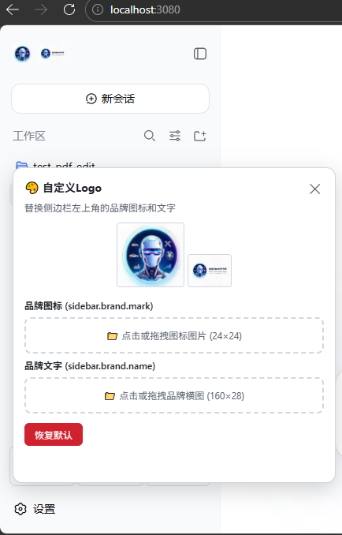

# dsh-logo-custom

DeepSeek Harness 自定义 Logo 插件 — 上传图片替换侧边栏左上角的品牌图标和文字。



## 功能

- **自定义品牌图标** — 上传图片替换 `sidebar.brand.mark` 插槽（鱼形 Logo）
- **自定义品牌文字** — 上传图片替换 `sidebar.brand.name` 插槽（品牌名称文字）
- **设置页配置** — 上传界面挂在 DSH 自带设置页，不再占用侧边栏按钮
- **一键恢复** — 随时恢复为默认的 DeepSeek Harness 品牌样式
- **实时生效** — 上传后立即生效，无需刷新页面
- **刷新持久化** — 页面刷新后自动恢复自定义 Logo

## 安装

### 本地构建安装

```bash
cd dsh-logo-custom
npm install
npm run build
npx @deepseek-ai/dsh plugin --profile web add .
```

### npx 一键安装

```bash
npx @deepseek-ai/dsh plugin --profile web add dsh-logo-custom
```

## 重启

安装后 **必须重启 DeepSeek Harness** 才能生效：

```bash
npx @deepseek-ai/dsh --profile web restart
```

## 使用

1. 打开 DeepSeek Harness **设置** 页面
2. 在配置界面中找到 **自定义 Logo**（优先出现在设置分区 / 插件配置卡片中）
3. 面板包含两个上传区域：
   - **品牌图标 (sidebar.brand.mark)** — 上传 24×24 大小的图标图片
   - **品牌文字 (sidebar.brand.name)** — 上传 160×28 大小的品牌横图
4. 点击上传区域或拖拽图片文件到该区域
5. 上传成功后，侧边栏左上角的品牌图标和文字会立即更新
6. 如需恢复默认，点击 **恢复默认** 按钮

## 配置

| 配置项 | 类型 | 默认值 | 说明 |
|--------|------|--------|------|
| `storageDir` | string | `~/.dsh/data/dsh-logo-custom` | 图片存储目录 |

配置示例：

```yaml
plugins:
  dsh-logo-custom:
    storageDir: /custom/path/to/logos
```

## 目录结构

```
dsh-logo-custom/
├── package.json          # 插件元数据 + dsh 配置
├── tsconfig.json         # TypeScript 编译配置
├── cordis.patch.yml      # Cordis 插件注册声明
├── scripts/
│   └── wrap-client.mjs   # 浏览器半打包脚本
└── src/
    ├── index.ts          # 宿主半：HTTP 路由 + 图片持久化
    └── client.ts         # 浏览器半：DOM 操作 + 上传面板
```

## 工作原理

| 模块 | 运行环境 | 职责 |
|------|----------|------|
| **宿主半 (Node)** | 服务端 | 提供图片上传/获取的 HTTP 路由，图片持久化存储 |
| **浏览器半 (Client)** | 浏览器 | MutationObserver 监听 DOM 变化替换品牌插槽，提供上传界面 |

### HTTP 路由

| 方法 | 路径 | 说明 |
|------|------|------|
| GET | `/dsh-logo-custom/logo` | 获取品牌图标 |
| POST | `/dsh-logo-custom/upload` | 上传品牌图标 |
| DELETE | `/dsh-logo-custom/logo` | 删除品牌图标 |
| GET | `/dsh-logo-custom/wordmark` | 获取品牌文字图片 |
| POST | `/dsh-logo-custom/wordmark-upload` | 上传品牌文字图片 |
| DELETE | `/dsh-logo-custom/wordmark` | 删除品牌文字图片 |

### 浏览器 DOM 锚点

```css
[data-slot="sidebar.brand.mark"]   /* 品牌图标容器 */
[data-slot="sidebar.brand.name"]   /* 品牌名称容器 */
设置页槽位 settings.section / settings.plugin.item（无槽位时回退到设置页 DOM）
```

## 兼容性

- DeepSeek Harness Web 版
- DeepSeek Harness Desktop 版

## 已知限制

1. 图片最大尺寸受服务器配置限制（通常 10MB）
2. 侧边栏折叠状态下只显示图标，不显示品牌文字
3. 品牌图标尺寸建议 24×24，品牌文字图片建议 160×28

## 许可证

Apache License 2.0
